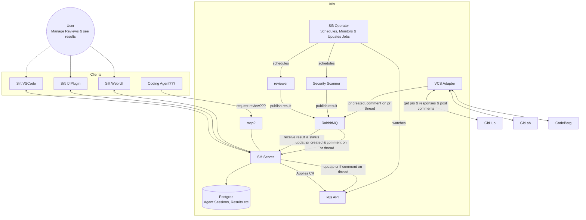

# System Architecture

This document describes the Sift system architecture (source: [architecture.png](architecture.png)).

Sift is an Open Source Agentic Code Review Platform designed for self-hosting and deployment on Kubernetes.

## Overview

- **Clients** (Sift VSCode, Sift IJ Plugin, Sift Web UI, and possibly a Coding Agent) let users manage reviews and see results. They talk to the **Sift Server** (partly via **MCP**).
- The **Sift Server** persists agent sessions and results in **Postgres** and applies Custom Resources (CRs) via the **k8s API**.
- The **Sift Operator** watches the k8s API and schedules, monitors & updates jobs — spawning **reviewer** and **security scanner** agent jobs.
- Agents publish their results to **RabbitMQ** (see [ADR 0001](adrs/0001-use-rabbitmq-as-message-queue.md)); the Sift Server consumes results and status updates from it.
- The **VCS Adapter** integrates with **GitHub**, **GitLab**, and **CodeBerg**: it gets PRs & responses, posts comments, and publishes events (PR created, comment on PR thread) to the MQ.

## Mermaid Diagram

## Components

| Component | Role |
|---|---|
| Sift VSCode / IJ Plugin / Web UI | Client frontends to manage reviews and see results |
| Coding Agent (???) | Potential future client requesting reviews (via MCP) |
| Sift Server | Central service; exposes API (and MCP), stores state in Postgres, applies CRs to the cluster, consumes MQ events |
| Postgres | Stores agent sessions, results, etc. |
| k8s API | Kubernetes API server; receives CRs from Sift Server, watched by the operator |
| Sift Operator | Watches CRs; schedules, monitors & updates agent jobs |
| reviewer | Code review agent job; publishes results to the MQ |
| Security Scanner | Security review agent job; publishes results to the MQ |
| RabbitMQ | Message queue transporting agent results, status updates, and VCS events (integrated via Spring AMQP, see [ADR 0001](adrs/0001-use-rabbitmq-as-message-queue.md)) |
| VCS Adapter | Integration with VCS providers: fetches PRs & responses, posts comments, emits PR/thread events |
| GitHub / GitLab / CodeBerg | Supported VCS providers |
