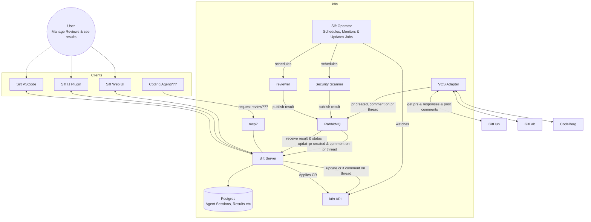

# System Architecture

This document describes the Sift system architecture (source: [architecture.png](architecture.png)).

Sift is an Open Source Agentic Code Review Platform designed for self-hosting and deployment on Kubernetes.

## Overview

- **Clients** (Sift VSCode, Sift IJ Plugin, Sift Web UI, and possibly a Coding Agent) let users manage reviews and see results. They talk to the **Sift Server** (partly via **MCP**).
- The **Sift Server** persists agent sessions and results in **Postgres** and applies Custom Resources (CRs) via the **k8s API**.
- The **Sift Operator** watches the k8s API and schedules, monitors & updates jobs — spawning **reviewer** and **security scanner** agent jobs.
  - `k8s/operator` uses the Java Operator SDK Spring starter and explicitly invokes a ConfigMap-before-Job workflow for manually applied CRs, without a server API or webhook. Owned execution snapshots are create-only, with a trusted configured image and read-only Spring configuration validated against packaged startup ([ADR 0007](adrs/0007-immutable-review-provisioning.md)). Generation changes cancel old Jobs, wait for their Pods, and coalesce to the latest execution; version-guarded status and terminal identities prevent stale updates and silent replay ([ADR 0008](adrs/0008-generation-safe-review-lifecycle.md)). The [CodeReview contract](system-components/code-review-operator.md) defines base branch/SHA, generation identity and the external agent/event handoff ([ADR 0006](adrs/0006-code-review-execution-contract.md)); image publication and the final SHA/event-correlated E2E gate remain separate deliverables.
- Agents publish their results to **RabbitMQ** (see [ADR 0001](adrs/0001-use-rabbitmq-as-message-queue.md)); the Sift Server consumes results and status updates from it.
  - Event payloads (e.g. `CodeReviewCompletedEvent`) are defined in the shared **`events`** module, so producers (agents) and the consumer (Sift Server) share one contract.
  - **`agents/shared`** provides the messaging abstraction (`EventPublisher` backed by RabbitMQ, publishing to the `sift.events` topic exchange) and shared agent tools, including the default-enabled **SearXNG** web-search tool (see [ADR 0002](adrs/0002-airgapped-agents-with-optional-searxng-web-search.md)). Operators configure their self-hosted SearXNG endpoint or explicitly disable search with `sift.tools.web-search.enabled=false`. Network isolation requires deployment-level controls; the tool setting does not enforce an airgap.
  - Shared messaging and web-search beans are discovered through Spring Boot auto-configuration; agents do not need to scan or import shared packages. Defaults back off for application-provided beans (see [ADR 0003](adrs/0003-auto-configure-shared-agent-infrastructure.md)).
  - Code review explicitly installs the shared `ToolAllowlistAdvisor` to check shell commands before execution. Shell execution defaults to denied until exact commands are configured, with denials returned as tool feedback. Non-shell tools pass through unrestricted by the advisor. This is not a filesystem or network sandbox (see [ADR 0005](adrs/0005-enforce-agent-tool-allowlists.md) and [shell command allowlist advisor](system-components/tool-allowlist-advisor.md)).
  - The code-review agent explicitly closes its Spring context after its one-shot runner completes, releasing RabbitMQ resources so the job can exit (see [ADR 0004](adrs/0004-close-one-shot-agent-context.md)).
  - The [review image workflow](system-components/code-review-image.md) packages a secret-free source context into a digest-pinned, nonroot runtime with native Git and permitted tooling ([ADR 0010](adrs/0010-review-image-packaging.md)). An arm64 candidate is published and runtime-validated; [acceptance evidence](validation/code-review-image-2026-09-06.md) explicitly records the missing external SHA/event contract and unresolved dependency findings, not a successful review gate.
  - For local development, RabbitMQ, Postgres, and SearXNG run via [docker-compose](../compose.yaml).
  - The [kind development workflow](system-components/local-kind-development.md) runs the operator with the supplied host kubeconfig and bridges review Pods to JB Central, Compose SearXNG, and RabbitMQ through fixed-upstream ClusterIP Services. Separate namespace-scoped operator RBAC is verified without claiming it restricts the host identity; credentials use administrator-provisioned Secrets ([ADR 0009](adrs/0009-local-kind-connectivity.md)).
- The **VCS Adapter** integrates with **GitHub**, **GitLab**, and **CodeBerg**: it gets PRs & responses, posts comments, and publishes events (PR created, comment on PR thread) to the MQ.

## Mermaid Diagram

## Components

| Component | Role |
|---|---|
| Sift VSCode / IJ Plugin / Web UI | Client frontends to manage reviews and see results |
| Coding Agent (???) | Potential future client requesting reviews (via MCP) |
| Sift Server | Central service; exposes API (and MCP), stores state in Postgres, applies CRs to the cluster, consumes MQ events |
| Postgres | Stores agent sessions, results, etc. |
| k8s API | Kubernetes API server; receives CRs from Sift Server, watched by the operator |
| Sift Operator | Watches CRs; schedules, monitors & updates agent jobs |
| reviewer | Code review agent job; publishes results to the MQ (see [code-review-agent](system-components/code-review-agent.md)) |
| Security Scanner | Security review agent job; publishes results to the MQ |
| RabbitMQ | Message queue transporting agent results, status updates, and VCS events (integrated via Spring AMQP, see [ADR 0001](adrs/0001-use-rabbitmq-as-message-queue.md)) |
| VCS Adapter | Integration with VCS providers: fetches PRs & responses, posts comments, emits PR/thread events |
| GitHub / GitLab / CodeBerg | Supported VCS providers |
| events (module) | Shared event contracts (`SiftEvent`, `CodeReviewCompletedEvent`, …) used by agents and the Sift Server |
| agents/shared (module) | Shared agent infrastructure: `EventPublisher` (RabbitMQ, `sift.events` exchange) and tools such as the optional SearXNG web search |
| SearXNG | Self-hosted metasearch engine backing the default-enabled agent web-search tool; part of the local compose stack (see [ADR 0002](adrs/0002-airgapped-agents-with-optional-searxng-web-search.md)) |
