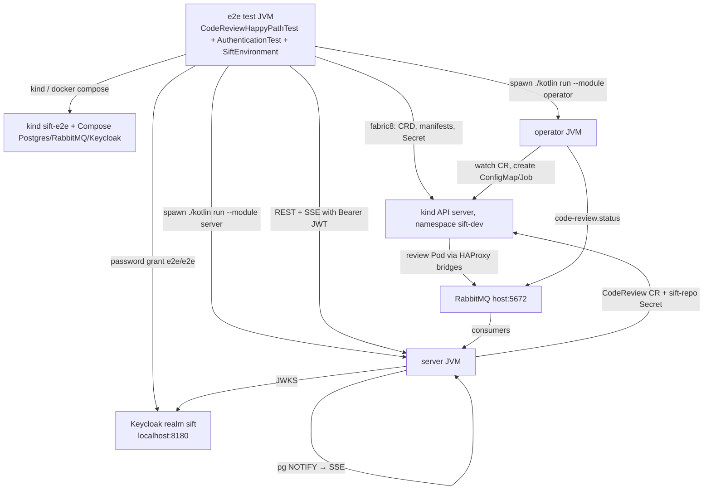

# End-to-end tests

The `e2e` module runs the **whole platform for real** on the developer host and verifies the
happy path purely through the [server](server.md) public API: a dedicated kind cluster, the
Compose Postgres, RabbitMQ and Keycloak, the operator and the server as separate host JVMs, and the
published code-review agent image. Nothing is mocked or stubbed — including authentication: the
harness logs in at the Compose Keycloak as the `e2e` user and sends real bearer tokens
([ADR 0016](../adrs/0016-oauth2-resource-server-and-user-attribution.md)). The harness decision and
its explicit exception to [ADR 0009](../adrs/0009-local-kind-connectivity.md) are recorded in
[ADR 0015](../adrs/0015-e2e-harness-dedicated-kind-cluster.md).

The suite complements, but does not replace, `server/test/.../ServerEndToEndTest.kt` (real
REST/SSE/RabbitMQ/Postgres, fabric8 mocked) and the Python helpers under `k8s/local`
(`acceptance.py`, `scheduling_check.py`), which remain the manual development workflow.

## What runs where



| Component | How the harness runs it |
|---|---|
| kind cluster `sift-e2e` | Created if absent, reused otherwise; kubeconfig at `build/e2e/kubeconfig`. The root `.kubeconfig` and the developer's `kind-kind` cluster are never read or modified. |
| CRD, namespace, ServiceAccounts, HAProxy bridges, operator RBAC | Server-side apply (field manager `sift-e2e`, label `app.kubernetes.io/managed-by: sift-e2e`) of `k8s/manifests/crds/codereviews.sift.org-v1.yml`, `k8s/manifests/local/*.yaml` and `k8s/manifests/operator/*.yaml`; waits for the CRD `Established` and the bridge Deployment `Available`. |
| `sift-local-credentials` Secret | Built from the process environment (`model-api-key`, `proxy-token`, `rabbitmq-password=sift`) and applied through the fabric8 API body only; values never reach logs or command lines. |
| Postgres, RabbitMQ, Keycloak | `docker compose up -d --wait postgres rabbitmq keycloak` from the repository root (fixed Compose ports that the bridges already forward to; Keycloak on `8180`, realm `sift` imported from `config/keycloak/sift-realm.json`). |
| Operator | `./kotlin run --module operator` with `KUBECONFIG=build/e2e/kubeconfig`, `SIFT_OPERATOR_NAMESPACE=sift-dev`, `SPRING_CONFIG_ADDITIONAL_LOCATION=file:…/k8s/local/operator.yaml`, `SPRING_RABBITMQ_PASSWORD=sift`; ready when the log shows `Started MainKt`. |
| Server | `./kotlin run --module server` with `KUBECONFIG`, `SIFT_SERVER_NAMESPACE=sift-dev`, a random `SIFT_SERVER_ENCRYPTION_KEY`, an ephemeral `SERVER_PORT`, `SERVER_ADDRESS=127.0.0.1`, `SPRING_SECURITY_OAUTH2_RESOURCESERVER_JWT_ISSUER_URI=http://localhost:8180/realms/sift`, `SPRING_SECURITY_OAUTH2_RESOURCESERVER_JWT_AUDIENCES=sift-server` and `SIFT_SERVER_AUTH_CLIENT_ID=sift-web`; ready when `GET /actuator/health/readiness` returns 200 (anonymous). |
| Access tokens | `KeycloakTokens.passwordGrant` (JDK `HttpClient`, form `POST ${issuer}/protocol/openid-connect/token` with `grant_type=password`, `client_id=sift-web`, `username=e2e`, `password=e2e`, `scope=openid profile email`). `SiftEnvironment.accessToken()` caches the token and renews it 30 s before expiry (realm lifespan 300 s); `env.api()` returns a `ServerApi` that adds `Authorization: Bearer …` to every request including the SSE watch, `env.anonymousApi()` sends none. |

Both child JVMs start with a **scrubbed environment**: `OPENAI_API_KEY`, `SIFT_MODEL_PROXY_TOKEN`,
`SIFT_REVIEW_AUTH_TOKEN`, `KUBECONFIG`, `SERVER_PORT`, `SERVER_ADDRESS` and every `SPRING_*`,
`KUBERNETES_*`, `SIFT_SERVER_*`, `SIFT_OPERATOR_*` variable are dropped before the harness adds
its own values, so host state cannot leak into the scenario. `SIFT_REVIEW_IMAGE` is passed
through unchanged, which lets you test a different published digest.

The startup budget is 5 minutes per JVM (the first run compiles both modules). The bootstrap runs
**once per test JVM** through the JUnit extension `SiftEnvironment` (root-store resource) and is
torn down when JUnit closes the store, also after failures.

## Prerequisites

- Docker Desktop (the bridges rely on `host.docker.internal`, see [ADR 0009](../adrs/0009-local-kind-connectivity.md)),
  `kind` and `kubectl` on `PATH`. The node architecture must match the published review image
  (arm64 today, see the [image workflow](code-review-image.md)); the harness prints the node
  architecture during bootstrap. Host ports `5432`, `5672` and `8180` must be free for the Compose
  services; Keycloak needs 10–40 s on a cold start, which `--wait` covers.
- The model proxy listening on `127.0.0.1:19516`; preflight fails otherwise. SearXNG on
  `127.0.0.1:8888` is only a warning (web search inside the agent will fail without it).
- Outbound HTTPS to `api.github.com` to resolve the sample pull request.
- Credentials in the **process environment**, never as command-line literals:
  `OPENAI_API_KEY` and `SIFT_MODEL_PROXY_TOKEN`.

Preflight runs before any side effect, so a missing tool or credential fails with a message naming
the prerequisite and leaves no half-created cluster or containers behind.

## Environment variables

| Variable | Required | Meaning |
|---|---|---|
| `SIFT_E2E` | yes (`true`) | Gate. When unset the e2e scenario is reported as *skipped*, so `./kotlin check` stays green on machines without Docker, kind or credentials. |
| `OPENAI_API_KEY` | yes | Forwarded into the `sift-local-credentials` Secret as `model-api-key`. |
| `SIFT_MODEL_PROXY_TOKEN` | yes | Forwarded as `proxy-token`; also the path segment of the model URL in `k8s/local/operator.yaml`. |
| `SIFT_E2E_PR` | no | Sample pull request `owner/repo#n`; default `frederikpietzko/ebfs-jpa#1`. The PR's head must live in the base repository (no fork), exactly as `acceptance.py` requires. |
| `GITHUB_TOKEN` | no | Sent as a bearer token to the GitHub API to avoid unauthenticated rate limits. |
| `SIFT_E2E_TIMEOUT` | no | Whole-scenario budget as a Kotlin `Duration` string (`20m`, `PT20M`, `1h 30m`); default `20m`. The first run also pulls the review image. |
| `SIFT_E2E_DESTROY` | no | `true` deletes the `sift-e2e` kind cluster and its kubeconfig in teardown. |
| `SIFT_REVIEW_IMAGE` | no | Passed through to the operator to override the default published digest. |

## Running

```shell
# Compile, detekt and the pure unit tests; the gated scenario is skipped:
./kotlin check --module e2e

# Full happy path (credentials exported by a trusted process, not typed as literals):
export OPENAI_API_KEY=… SIFT_MODEL_PROXY_TOKEN=…
SIFT_E2E=true ./kotlin check tests --module e2e
```

The convenience wrapper `tools/e2e.sh` does the same: it sources credentials from the git-ignored
`tools/e2e.env` (template: `tools/e2e.env.example`), sets `SIFT_E2E=true` and forwards
`--pr`, `--timeout`, `--destroy` and anything after `--` to `./kotlin check tests --module e2e`.

In this toolchain the runnable command is `./kotlin check tests --module e2e` (or plain
`./kotlin check --module e2e`); there is no `./kotlin test --module …`. Filter the output for
`key`/`token` if you tee it into a shared log.

Typical timings: a fresh machine needs several minutes (cluster creation, image pull, first
compile of operator and server); a warm re-run bootstraps in about 40 seconds and the real review
completes in a few minutes. Observed phase sequence on the real stack is
`PENDING → RUNNING → SUCCESS` (the SSE `SNAPSHOT` carries `CREATED`; there is no `CREATED`
`UPDATED` frame).

## Scenario and assertion policy

`AuthenticationTest` (`e2e/test`) checks the security contract against the real Keycloak:

1. Anonymous `GET /api/v1/agents` → `401` with a problem detail (`status == 401`, string `title`).
2. Anonymous `GET /api/v1/auth/config` → `200` with exactly the fields `issuerUri` (the Keycloak
   realm), `clientId` (`sift-web`) and a non-empty `scopes` array — nothing else, in particular no
   secret.
3. `GET /api/v1/me` with a password-grant token → `username == "e2e"`, `issuer` equals the realm,
   non-blank `subject`, `email == "e2e@sift.local"`.

`CodeReviewHappyPathTest` (`e2e/test`) drives everything through `http://127.0.0.1:<port>` as the
authenticated `e2e` user (`env.api()`):

1. `POST /api/v1/repositories` `{name: "e2e-<uuid>", url: <PR base clone URL>}` → `201`.
2. `POST /api/v1/agents` `{kind: CODE_REVIEW, repositoryId, branch, baseBranch, commitSha, pullRequest}`
   resolved from the GitHub PR → `202`, body `phase == CREATED`, non-blank `crUid`,
   `createdBy.username == "e2e"` and `createdBy.id` equal to the `id` from `GET /api/v1/me`;
   `GET /api/v1/agents?mine=true&repositoryId=<id>` lists the run.
3. `GET /api/v1/agents/watch?agentId=<id>` (`Accept: text/event-stream`) → first frame `SNAPSHOT`
   for that id; `UPDATED` frames are followed until a terminal phase. The run must end in
   `SUCCESS` with `RUNNING` observed before it and exactly one terminal phase, last. `FAILED` and
   `CANCELLED` fail fast and quote the payload's `reason`/`message` (for example `ImagePullFailed`)
   so the cause is visible without opening logs.
4. `GET /api/v1/agents/{id}` → `phase == SUCCESS`, `completedAt` present, `executionId == "<crUid>:1"`,
   `createdBy` still the `e2e` user.
5. `GET /api/v1/results?agentRunId=<id>` → `total == 1`, item `commitSha` equals the requested SHA;
   `GET /api/v1/results/{id}` → `summary` is a non-blank string, `findings` is a JSON array (may be
   empty) and `findingCount` equals its size. The result id is kept for step 8.
6. `PUT /api/v1/agents/{id}` with the same spec revises the finished run → `201 Created`, a **new** run
   id in phase `CREATED` whose `supersedesRunId` is the predecessor
   ([ADR 0019](../adrs/0019-immutable-agent-runs-revised-by-succession.md)).
7. The successor is watched exactly like step 3 and must also end in `SUCCESS`, proving a revised run
   is provisioned and executed like any other.
8. `GET /api/v1/agents/{predecessor}` → `supersededByRunId` is the successor and
   `GET /api/v1/agents/{successor}` → `supersedesRunId` is the predecessor (both directions resolve);
   `GET /api/v1/results?agentRunId=<predecessor>` still returns the **same** result id as step 5 and
   `GET /api/v1/results/{that id}` still serves it, so revising never drops the predecessor's stored
   result even though its `CodeReview` is gone. The successor's own result is verified as in step 5.

The test is meant to stay green as the product evolves, so it asserts **only stable public
contracts**: HTTP status codes, phase transitions, presence and shape of the result. It never
asserts on LLM output, finding content, exact timings, intermediate resource names, the presence
of `PENDING`, or non-final reasons. Repeated `UPDATED` frames with the same phase and SSE
`:heartbeat` comments are tolerated. Negative scenarios (image pull failures, cancellation,
deadline exceeded) are out of scope here and covered by module tests and
`k8s/local/scheduling_check.py`.

`SiftEnvironmentSmokeTest` additionally checks the anonymous readiness probe and an authenticated
`GET /api/v1/repositories` (`200`).

Pure helper tests (`SseFrameParserTest`, `SamplePullRequestTest`, `HostProcessEnvTest`,
`PreflightTest`, `ShellTest`, `ClusterResourcesTest`, `KeycloakTokensTest` — token endpoint
derivation, form encoding, response parsing and expiry margin) always run and need no infrastructure.

## Teardown

Teardown always runs, also when the scenario fails:

- The scenario's `finally` deletes **test data only**: the `CodeReview` CRs of both the original and the
  revised run (`crName` from each run response) and the `sift-repo-<repositoryId>` Secret via fabric8,
  then the `review_results`, `agent_runs` and `repositories` rows via JDBC
  (`jdbc:postgresql://localhost:5432/sift`, `sift`/`sift`).
  The `users` row of the `e2e` user is kept (it is upserted on the next request anyway;
  `agent_runs.created_by` references it, so runs must always be deleted before users).
- `SiftEnvironment` stops the server and operator JVMs (most recent first) including all
  descendants of the `./kotlin run` wrapper (SIGTERM, SIGKILL after 20 s) and prints the log paths.
- The kind cluster, the Compose containers (including Keycloak), the applied manifests and the
  `sift-local-credentials` Secret are **kept** for fast re-runs. `SIFT_E2E_DESTROY=true` additionally
  deletes the cluster.

Concurrent runs against the same `sift-dev` namespace and database are unsupported; the harness
uses unique `e2e-<uuid>` repository names but does not lock.

### Follow-up: repository deletion with terminal runs

The harness deliberately does not call `DELETE /api/v1/repositories/{id}`. `V1__init.sql` declares
`agent_runs.repository_id` as a foreign key without cascade and `RepositoryService.delete` only
guards *active* runs, so the API delete hits a foreign-key violation once a run has finished. This
is a product gap to fix in the server (cascade or explicit `409` for repositories with historical
runs); until then the e2e cleanup uses JDBC for the rows and fabric8 for the CR and Secret.

## Logs and troubleshooting

| Artifact | Location |
|---|---|
| Operator output | `build/e2e/operator.log` |
| Server output | `build/e2e/server.log` |
| Cluster kubeconfig | `build/e2e/kubeconfig` (`kubectl --kubeconfig build/e2e/kubeconfig -n sift-dev get codereviews,jobs,pods`) |

| Symptom | Likely cause / action |
|---|---|
| `Missing required tool(s) on PATH` | Install Docker Desktop, kind, kubectl; make sure Docker is running. |
| `Set OPENAI_API_KEY …` / `Set SIFT_MODEL_PROXY_TOKEN …` | Export the credentials in the shell that runs the tests. |
| `Nothing is listening on 127.0.0.1:19516` | Start the model proxy first. |
| GitHub lookup fails / `Fork guard` error | Check connectivity or rate limit (`GITHUB_TOKEN`), or pick another PR with `SIFT_E2E_PR` whose head lives in the base repository. |
| `operator: no log line matched /Started MainKt/` or `server … did not answer 200` | Open the log above; usual causes are a Compose broker/database not reachable or a compile error in the module. |
| `docker compose up --wait` hangs on `keycloak` | Cold start can take up to 40 s; check `docker compose logs keycloak`. A realm import error usually means `config/keycloak/sift-realm.json` was edited — recreate the container with `docker compose rm -sf keycloak && docker compose up -d --wait keycloak` (import is `IGNORE_EXISTING`). |
| Token request fails (`passwordGrant` throws) or every API call is `401` | Keycloak not healthy or the realm not imported (`curl http://localhost:8180/realms/sift/.well-known/openid-configuration`); tokens missing `preferred_username`/`email`/`aud=sift-server` indicate a modified realm export — the audience mapper must live under the `sift-web` client's `protocolMappers` and the built-in `profile`/`email` scopes must not be overridden. |
| Run ends in `FAILED` with `ImagePullFailed` | Node architecture does not match the published image or the digest is stale; override with `SIFT_REVIEW_IMAGE`. |
| Scenario times out in `RUNNING` | Review slower than the budget (first image pull, slow model); raise `SIFT_E2E_TIMEOUT` and check the review Pod logs with the kubeconfig above. |
| Stale state after an aborted run | Test data is removed in `finally`; if the JVM was killed hard, delete leftover `codereviews` and `sift-repo-*` Secrets in `sift-dev` and the `e2e-*` repository rows manually, or run with `SIFT_E2E_DESTROY=true` once. |
