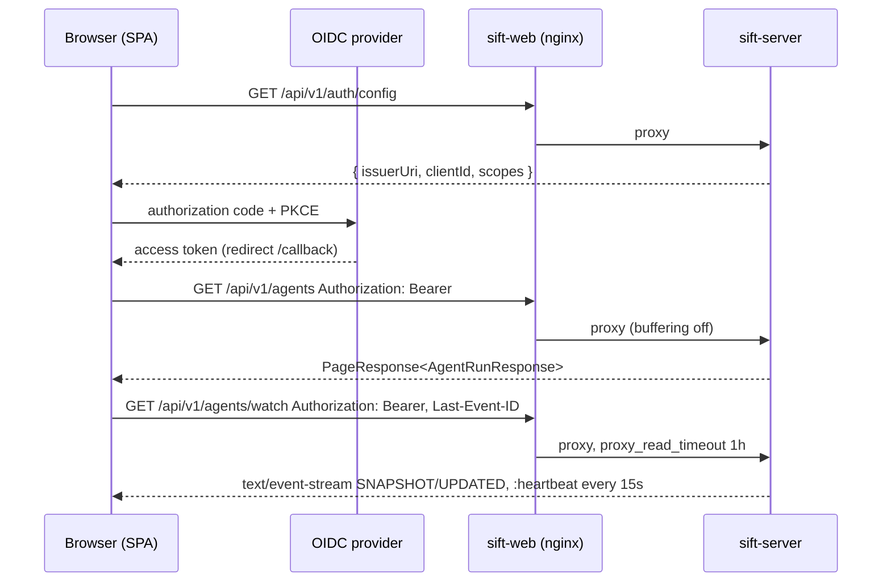

# Web UI

`web/` is the browser client of Sift: a pnpm workspace with the framework-agnostic, typed API client
`@sift/api-client` (`web/packages/api-client`) and the React SPA `@sift/web` (`web/apps/web`), packaged as the
`sift-web` nginx image that serves the SPA and proxies the API to the [server](server.md) on the same origin
([ADR 0018](../adrs/0018-shared-openapi-contract-and-web-ui.md)). Developer-facing details (commands,
workspace layout, code conventions per screen) live in [`web/README.md`](../../web/README.md); this page covers
the component's role, contract, deployment and operations.

Status: complete for this iteration — login, repositories, live runs dashboard with trigger/cancel, review
results viewer, image and manifests. Browser end-to-end tests and the VSCode/IntelliJ plugins are follow-ups.

## Responsibilities

| Concern | Where | Behaviour |
|---|---|---|
| Contract | [`api/openapi.yaml`](../../api/openapi.yaml) → `packages/api-client/src/generated/schema.d.ts` | Types are generated with `openapi-typescript` and committed; `pnpm generate:check` fails when they lag behind the spec, `OpenApiContractTest` fails when the spec lags behind the server ([`api/README.md`](../../api/README.md)). |
| HTTP client | `packages/api-client/src/client.ts`, `errors.ts` | `createSiftClient({ baseUrl, getAccessToken, onUnauthorized })` — `openapi-fetch` with a middleware that attaches `Authorization: Bearer …`; every non-2xx response is thrown as `SiftApiError { status, problem: ProblemDetail }` (`isConflict`, `isNotFound`, …). |
| Live updates | `packages/api-client/src/sse.ts` | `watchAgentRuns(client, { signal, query, onEvent })` reads `GET /api/v1/agents/watch` through `fetch` + `ReadableStream` (a native `EventSource` cannot send the bearer header), parses `id:`/`event:`/multi-line `data:`/`:heartbeat` frames, reconnects with `Last-Event-ID` and a freshly resolved token, and stops on abort or a definitive 400/403/404. |
| Authentication | `apps/web/src/auth/` | `AuthProvider` bootstraps from the anonymous `GET /api/v1/auth/config`, runs authorization code + PKCE with `oidc-client-ts` (`redirect_uri` = `<origin>/callback`, silent renew, session storage) and installs token provider + 401 handler on the client singleton; `RequireAuth` guards every route below `_authenticated`; the header shows `GET /api/v1/me`. Only the user's own access token ever reaches the browser. |
| Screens | `apps/web/src/routes`, `features/*`, `api/hooks/*` | `/runs` (filterable, paginated, live via SSE; "Start review" dialog with 40-hex SHA validation → 202 → detail), `/runs/$runId` (spec, phase/reason/message, timestamps, creator or "external", cancel disabled for terminal phases, link to the result), `/repositories` (CRUD, write-only token with `hasToken` badge, clear token, inline 400/409 problem details), `/results` (filters `repositoryUrl`/`commitSha`/`agentRunId`), `/results/$resultId` (Markdown summary, findings grouped by file with severity badges, server-side `severity`/`file` filters). |
| Serving | `apps/web/Dockerfile`, `apps/web/nginx.conf` | `sift-web` image: SPA with history fallback, `/api/` and `/v3/api-docs` proxied unbuffered to `SIFT_SERVER_UPSTREAM`, immutable caching for `/assets/`, `/healthz` for probes. |

Stack: React 19, Vite, TypeScript 5.9, Tailwind CSS v4 + shadcn/ui (Radix primitives), TanStack Router
(file-based routes) + TanStack Query, `react-hook-form` + `zod`, `oidc-client-ts`, `react-markdown` (raw HTML
escaped), `sonner`; tests with Vitest, Testing Library and MSW handlers typed from the generated schema. Node 22
(`web/.nvmrc`), pnpm 11 (`packageManager`).

## Request flow



In development the Vite dev server (`pnpm dev`, <http://localhost:5173>) takes nginx's place and proxies `/api`
to `http://localhost:8080` (`SIFT_API_URL` overrides); the Compose Keycloak realm already allows
`http://localhost:*` redirect URIs, so `dev`/`dev` works without further setup.

## Image

`web/apps/web/Dockerfile`, built with the workspace root as context (`web/.dockerignore` excludes
`node_modules`, `dist`):

```shell
docker build -f apps/web/Dockerfile -t sift-web:dev web/
docker run --rm -p 8081:8080 -e SIFT_SERVER_UPSTREAM=http://host.docker.internal:8080 sift-web:dev
```

- Stage 1 (`node:22-alpine`, digest-pinned): `pnpm install --frozen-lockfile` from the manifests only (cached
  layer), then `pnpm --filter @sift/web build`. The api-client is consumed from source, nothing else is built.
- Stage 2 (`nginxinc/nginx-unprivileged:1.29-alpine`, digest-pinned): copies `dist/` to
  `/usr/share/nginx/html` and `nginx.conf` as `/etc/nginx/templates/default.conf.template`. The image
  entrypoint renders it with `envsubst` on start — restricted by `NGINX_ENVSUBST_FILTER` to `SIFT_*` and
  `NGINX_LOCAL_RESOLVERS`, so nginx variables (`$uri`, `$host`) survive — into `/tmp/default.conf`, which the
  main `nginx.conf` includes (the stock `conf.d` include is redirected). `/tmp` is therefore the only writable
  path (pid file, temp paths, rendered config) and the container runs with a read-only root filesystem as
  uid `101`.
- `NGINX_ENTRYPOINT_LOCAL_RESOLVERS=1` makes the entrypoint export the Pod's `/etc/resolv.conf` nameservers;
  `nginx.conf` uses them as `resolver` and proxies to the variable `$sift_upstream`, so the upstream host is
  resolved per request (30s cache). nginx starts, and the Pod becomes ready, even if `sift-server` does not
  exist yet — `/api/` answers `502` until it does.

| Variable | Default | Purpose |
|---|---|---|
| `SIFT_SERVER_UPSTREAM` | `http://sift-server:8080` | Where `/api/` and `/v3/api-docs` are proxied to. |
| `NGINX_ENVSUBST_FILTER` | `^(SIFT_\|NGINX_LOCAL_RESOLVERS$)` | Variables substituted in the template; do not widen it. |
| `NGINX_ENVSUBST_OUTPUT_DIR` | `/tmp` | Where the rendered server block lands. |

`nginx.conf` in brief: `location /api/` — `proxy_http_version 1.1`, `Connection ""`, `proxy_buffering off`,
`proxy_request_buffering off`, `proxy_cache off`, `proxy_read_timeout`/`proxy_send_timeout 1h` (idle SSE streams
receive a `:heartbeat` every 15s, so the timeout only matters for stuck connections), forwards `Host`,
`X-Forwarded-For`, `X-Forwarded-Proto`; `location /assets/` — `Cache-Control: public, max-age=31536000,
immutable` (Vite content-hashes the file names); `location /` — `try_files $uri $uri/ /index.html` with
`Cache-Control: no-cache` so a new deployment is picked up on the next navigation; `location = /healthz` —
`200 ok`, unlogged. `server_tokens off`, gzip for text/JS/CSS/JSON/SVG.

## Deployment

`k8s/manifests/web/` mirrors the server manifests (namespace `sift-dev`, labels
`app.kubernetes.io/name: sift-web`, `app.kubernetes.io/managed-by: sift-local-dev`):

| File | Contents |
|---|---|
| `deployment.yaml` | Deployment `sift-web`, 1 replica (stateless, scale freely), no ServiceAccount token, `SIFT_SERVER_UPSTREAM=http://sift-server:8080`, container port `8080`, startup/liveness/readiness probes on `/healthz`, requests `50m`/`64Mi`, limits `250m`/`128Mi`, nonroot uid/gid `101`, `RuntimeDefault` seccomp, read-only root filesystem with an `emptyDir` on `/tmp`, all capabilities dropped. The image `jbfpietzko/sift-web:latest` is a placeholder until a web image is published. |
| `service.yaml` | ClusterIP Service `sift-web`, port `80` → `http` (8080). |
| `ingress.yaml` | Commented example only. Routes the whole host to `sift-web` (nginx in the Pod does the `/api/` split) with ingress-nginx annotations `proxy-buffering: "off"` and 3600s read/send timeouts for the SSE stream. TLS termination stays the operator's responsibility ([ADR 0016](../adrs/0016-oauth2-resource-server-and-user-attribution.md)). |

```shell
kubectl --kubeconfig "$PWD/.kubeconfig" apply --dry-run=client -f k8s/manifests/web/
kubectl --kubeconfig "$PWD/.kubeconfig" apply -f k8s/manifests/web/
kubectl --kubeconfig "$PWD/.kubeconfig" -n sift-dev port-forward svc/sift-web 8081:80   # http://localhost:8081
```

For the kind cluster build and load the image first (`docker build -f apps/web/Dockerfile -t sift-web:dev web/ &&
kind load docker-image sift-web:dev --name kind`) and point the Deployment at `docker.io/library/sift-web:dev`
with `imagePullPolicy: Never`. The OIDC client used by the SPA (`sift-web` in the identity provider,
`SIFT_SERVER_AUTH_CLIENT_ID` on the server) must list the UI's origin + `/callback` as a redirect URI; the
browser also needs to reach the issuer URL that the server announces (`issuerUri` from `GET /api/v1/auth/config`
must be valid from the user's machine, not only from inside the cluster).

## Verification

- `pnpm check` in `web/`: `generate:check`, ESLint, Prettier, `tsc`, Vitest (api-client SSE parser and error
  mapping; per-screen component tests with MSW), `vite build`. Not part of `./kotlin check`.
- Contract pair: `./kotlin check` fails on server/spec drift, `pnpm generate:check` on spec/types drift.
- Image smoke test: `docker run --read-only --tmpfs /tmp:uid=101,gid=101 --cap-drop ALL …` then
  `curl /healthz` (200), `curl /runs/any` (200, `index.html`, `no-cache`), an `/assets/*.js` URL (`immutable`),
  `/api/v1/auth/config` (proxied; `502` while no server is reachable).
- Manifests: `kubectl apply --dry-run=client -f k8s/manifests/web/` and a rollout in the kind cluster (the Pod
  becomes ready without a `sift-server` Service).

## Out of scope

- Browser end-to-end tests (Playwright) and a kind-deployed web smoke test in the `e2e` module.
- Publishing `sift-web` and `@sift/api-client`; both are built from source today.
- VSCode and IntelliJ plugins — they consume `api/openapi.yaml` and `@sift/api-client` but are not started.
- An authorisation model in the UI (the server's authorisation is flat, see [server](server.md#security)).
